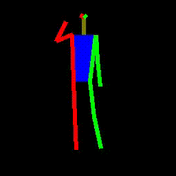

# VUNet
VUNet is a model proposed by Esser et al. in their paper [A Variational U-Net for Conditional Appearance and Shape Generation](https://compvis.github.io/vunet/images/vunet.pdf).
The model can learn the correspondings between the shape (pose, for example) and the appearance information 
in a still image. After the model was trained, we can just input an image only with shape information to synthesize 
underlying appearance. Further, we can transfer the appearance information from one image to another while retain the shape.

For more detail, please refer to [VUNet Project homepage](https://compvis.github.io/vunet/).

# About this repo
Esser has release their [official code](https://github.com/CompVis/vunet) which is implemented using Tensorflow. And Jhaxu
provided a Pytorch version implementation [here](https://github.com/jhaux/VUNet), but I found its result was not as good as original one 
and some key features were missed. Moreover, Jhaxu used the edflow package which I am not familiar with.

So, for those who are interested in VUNet and want to train the model from scratch to reproduce the results in original paper, you 
come to the right place. I spent a really really really hard time trying to reproduce it and finally I almost get there. The code
in this repo was purely based on Pytorch and you don't have to learn the complex structure setting of code and config in edflow.

Currently, only the deepfasion dataset is supported.

# Usage
- clone this repo 
```
git clone https://github.com/LiUzHiAn/VUNet-reproduce.git`.
``` 
- download the dataset

[Download](https://heibox.uni-heidelberg.de/d/71842715a8/) and unpack the dataset and unpack the desired dataset. This 
results in a folder containing an index.p file. Then, put the dataset anywhere you like.
- install the packages

For me, I find edflow not very easy to use. But in actual, it provides a convenient utility function named `adjust_support()`
to convert the range of image (e.g. 0->255 to -1->1). Other packages used in this repo are really common, such as Pytorch,cv2,PIL,ect.
Any version of Pytorch fitting you environment is Okay. Please install the packages accordingly after a glance of the code.
- set the hyper-parameters

All the hyper-parameters are put in the `hyper-parameters.ymal` file. Feel free to modify it correctly.
- how to train

```shell script
python MyTrain.py
```
A good GPU is highly recommended to train the mode。
- inference

The ckpt file will be saved at `ckpt` folder by default. You can switch between these three mode of {`train`/`appearance_transfer`/`sample_appearance`}
as you want. Please take a look [here](./models/vunet.py#L506-#L532).

# Some Notes
This repo follows the processings of official code strictly and  adds some key features that were missed in Jhaux's implementation. 
Specifically, they are:
- We generate the stickman image as official tf code did;
- We add the in-plane normalization;
- VGG loss in Jhaux's repo was incorrect and affects the quality of the generated pictures directly.
 The VGG loss in this repo is bug-free; 

# Training results
We provide some visualization results during training processing below. The left is input stickman image, and the right is reconstructed image.


# Pre-trained models
To be done.
# References
Most of the code was borrowed from the [official code](https://github.com/CompVis/vunet) and [Jhaux's repo](https://github.com/jhaux/VUNet).
For details, please refer to the [original VUNet paper](https://compvis.github.io/vunet/images/vunet.pdf).